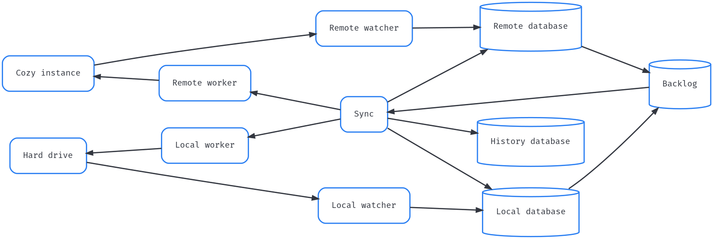

# [RFC] A new start for cozy-desktop

## Introduction

[Cozy Drive for Desktop](https://github.com/cozy-labs/cozy-desktop) allows you
to synchronize the files stored in [your Cozy](https://cozy.io) with your
laptop and/or desktop computer. It replicates your files on your hard drive and
applies the changes you make to them on other synchronized devices and on [your
online Cozy](https://github.com/cozy/cozy-stack).

The current version of code kinds of work, but it has accumulated lot of edge
cases, and specific stuff, and some technical debt, etc. It is really hard to
understand to understand the high-level flow, and how one small change can
impact the global behavior. Thus, it will take very long to go to the next
level of reliability and to add features like selective synchronization (aka "I
want to synchronize this directory but not this one"). This document explain
how I will do it if I could start again. I hope it will be useful someday, and
in the mean time, comments about it are welcomed.

## Limits of the current model

The design of the actual version of cozy-desktop is explained on
https://cozy-labs.github.io/cozy-desktop/doc/developer/design.html.
It was written for Cozy v2, several years ago, with some assumptions that are
no longer relevant. In particular, I made the trade-off to accept that a move
on the local file system can be sometimes detected and handled as if the file
was deleted and recreated. This is not acceptable for Cozy v3, where a file on
the cozy instance can have references.

I also have more experience on the subject, like knowing the tricks and traps
of inotify, fsevents and ReadDirectoryChangesW. And even if the core
technologies for that haven't changed, there are still some improvements. The
most notable one is that `nodejs` numbers didn't have enough precision for
[fileId on windows](https://github.com/nodejs/node/issues/12115) until very
recently.

But let's talk about the real flaws of the actual design. First and foremost,
it was always obvious to me that having two databases, one for local files and
one for remote files couldn't work and I choose to take a single database
approach with eventual consistency, inspired by CouchDB and PouchDB. I now
realize that having more databases is better: it helps to split the problem in
several sub-problems that are easier to manage. Notably, it's a lot harder to
use inotify, fsevents and ReadDirectoryChangesW that I imagined, and having a
database with local files help to put apart the issues of knowing what happen
on the local file system. In particular, when I started cozy-dekstop, I hoped
that a library like chokidar can help to mask the differences between the three
FS watching technologies (even if I anticipated that chokidar will have bugs,
and that we would need to contribute to it). Now, I understand that for
cozy-desktop, it's a mistake to hide the low-levels details of the FS watchers,
and the differences are too important to have a single library with the same
behavior for the three.

There are also some things that could have been managed better. In particular,
I think it was a mistake to try to resolve conflicts without writing before in
the database. Conflicts are complicated to serialize in the database, but not
doing so is worse: they don't follow the logical flow, duplicate some code, and
introduce a lot of subtle bugs.

## Things to keep

### Retry strategy

One thing that has helped a lot in the current cozy-desktop is its retry
strategy. Instead of aiming for a perfect synchronization strategy where each
operation succeed at its first try, we have accepted that we will have some
intermittent errors and that we should retry synchronization after a failure.
The details, like we retry up to 10 times, with a back-off function to space
out the retry in time, are not as important as the fact that retry is crucial
for cozy-desktop work.

### Staging area

When a file is downloaded by cozy-desktop from the Cozy, it is not written
directly in the synchronized directory. It is first put in a temporary
directory, and only moved to the synchronized directory when it is ready. It
helps to pollute the synchronized directory when the download fails, and to
avoid confusion by limiting the events for this file that the local watcher
will see.

## New version

### Remote

This part is easy: we use the changes feed from CouchDB to put the files
documents in a pouchdb/sqlite/whatever database. In this database, we keep the
relevant data about the directories and files: id and rev, type, name, dir_id,
updated_at, trashed, md5sum, size, executable and tags. But more important, we
don't keep the fullpath (except maybe for debugging purpose).

To know when to pull the documents from the changes feed, we should use the
realtime endpoint from the stack (websocket) to know when there is activity.
With a debounce of 2 seconds, we can be really reactive to the changes made on
the cozy (when online).

This new version is a lot easier than the current one (no need to analyze the
changes feed to regroup the files and directories moved at the same time), even
if we still have to be careful about the transitions between online and
offline.

### Local

The local watcher is probably the part that I've spent the most time, and I
still haven't figured how do it in a reliable way. Well, there is the fuse way
where we intercept the syscalls for the files and directories inside the
synchronized path, but it doesn't look like we can do something user friendly
on the 3 platforms (windows, macOS and GNU/Linux, but mainly windows). So let's
forget that. What we want is to have in a database the list of files and
directories, with some fields for each of them. Most of these fields can be
filled with stat(2), with the exception of checksum (a md5sum currently, but it
may be a sha256sum one day).

#### The identifier

The first issue is the identifier to use for this database: the primary key
that will really identify a file or folder, and be used as a foreign key in
other databases. The first obvious candidate is the path. It was my first
choice, in a variant where the path was upper-cased for case-insensitive file
systems. It means that when a folder moves, we have a lot of documents to
update. It can introduce some bugs, for example, if a file in a moved directory
is also updated in the same short period of time. But the more important con
for me is that the same identifier (path) can be used for 2 distinct file or
directory: not at the same time, but one after the other, and if we have a
foreign key from another database, it's really tricky if we can differentiate
if it is the same file or not.

Another candidate is the fileID (windows) or inode number (macOS, GNU/Linux).
It doesn't have the first con (when we move a folder, the identifiers for all
the documents remain the same, we just need to update one document), but it has
the second (the inode numbers can be reused after being freed).

Using an identifier composed from the fileID/inode and a generation has crossed
my mind, but I think that using auto-incremented IDs can work and may be
simpler. We should still have the fileID / inode number in a field (with a
unique index it it's available).

#### Startup

I think the more reliable way to have up to date information about the file in
local when the client is started is to create another database, to fill it, and
when we are done, replace the old database with the new one. If all the files
and directories were frozen when the client starts and scans the files to see
if they have changed since the last time, it would be simpler to just update
the records. But, it's not the case, and it can introduce subtle bugs in the
detection of the files that were deleted while the client was not running.
That's why I suggests to use another database during the startup.

#### FS Watchers

I'm convinced that, for cozy-desktop, it's better to be near the FS watchers,
inotify, FsEvents, and ReadDirectoryChangesW, and avoid high level library like
chokidar. And we can't have exactly the same code for the 3 platforms.

When we start playing with the FS watchers, it's tempting to think that the
events will give us all the information we need. With the time, we see it's not
the case, and we have to use `stat(2)` and other tricks to "fix" the events.
I've read on Internet someone that advices to just take the path of each event
and discard everything else, and then rebuild the information from the file
system. For cozy-desktop, I think the good way is a middle ground between these
2 extremes, and it's not the same for all the OSes. On macOS, the batching of
the events make them less useful than on windows and Linux.

#### Move detection

When a file or directory is moved, we need to keep track that it is the same
file, in order to use the same identifier.

For macOS and windows, the FS watcher doesn't tell us that a file or directory
is moved: we have to infer it from two events with the same inode number or
fileID (the deletion at the old path and the create at the new path). For
Linux, inotify had a cookie to these events, so it's a bit easier.

But, the FS watcher is only available when the client is running. If the file
or directory is moved when the client was stopped, we still have to detect the
move. On Linux, the inode numbers can be reused very fast, so it's not a good
idea to rely on it. One idea could be add an extended attributes (`xattr`) with
the identifier from the file in the local database to the file on the FS, and
use it to detect files renamed/moved while the client was stopped.

#### Recipe

I know, I didn't describe how the local watcher should work, only gave some
general directions. In fact, I don't see how the local watcher should work for
macOS. On Linux and windows, the work with atom/watcher and the buffers/steps
is a solid start. We should use sooner the information from the local database,
as it would be now easier to do that. For macOS, maybe we should develop several
prototypes and see which one works the best.

### Backlog

By backlog, I mean the list of files and folders that will need to be
synchronized (or at least to check in case of doubt). In the current version of
cozy-desktop, the backlog is implicit: we keep a sequence number and take the
first document from the pouchdb changes feed after this sequence number. It
works fine, but it has some limitations. We can't query the changes feed or
reorder documents inside it (except by writing to a document that automatically
moves it to the end).

In the new version, I think we should move the backlog to a dedicated database
(or table/keyspace/whatever). We can query the database, and can choose to
synchronize new files before deleting old ones. As an optimization, we can add
QoS by transfering first the small files (< 100 ko), then the medium ones, and
keeps the large ones (> 10Mo) for inactive periods. And, if we want to go
further, we can query a batch of small files and download them in [a single
request as a zip](https://docs.cozy.io/en/cozy-stack/files/#post-filesarchive).

It's also possible to say that, when an error happened, to not retry to
synchronize a file/directory before some amount of time (with an exponential
back-off rule for example).

I don't have a precise list of things to put in the backlog, but we can start
with these properties for each job:
- `id`: an auto-incremented id that identify the job
- `side`: `local` or `remote` to say what side has added the job
- `side_id`: the auto-incremented ids for `local`, or the uuid if `remote`
- `kind`: `file` or `directory`
- `size`: for files only
- `errors`: the number of errors for synchronizing this file (most often 0)
- `not_before`: we should not try to synchronize the file before this date
  (after an error).

### History

The history database is where we keep information about files and directories
the last time they were synchronized.
- `local_id`: the identifier of this file in the local database
- `remote_id`: the UUID of this file in the remote database
- `kind`: `file` or `directory`
- `path`: the path of this file or directory
- `size` and `md5sum`: for files only.

As you can see, some fields are missing, like `executable`. Maybe I'm wrong,
but I don't think it is useful to keep them here, as they are not used to know
what actions should be done on a file, only how to perform these actions (and
we will use the local or remote document at this stage).

### Sync

And now, let's the magic happens!

In sync, we take jobs from the backlog, and for each of them, we use this
(here, it is a version where `side` is `local` and `kind` is `file`, but it's
easy to infer the other versions from it):

And, when done, we should not forget to remove the job from the backlog.

#### Caveats

I've ignored the complexity introduced by the case insensitivity of some file
systems. We should figure it later, I'm not worried by that.

We need to know the local and remote identifiers of a file when we insert a
record for it in the history database. For remote, we can expect the get it
from the response of the cozy-stack, but in local, the inode or fileID is not
enough. We may use the local database, but if we just read inside it, we have
to wait that the event is fired by the TS watcher and handled by the local
watcher: it's slow and can introduce some edge cases. Another possibility would
be that Sync sends a fake event to the local watcher and got the identifier in
response, but I'm not totally convinced too. Yet another option would be to put
an incomplete record in the history database, and use the extended attributes
of the local filesystem to put the identifier of the file from the history
database in the extended attributes. It would allow to make the matching later.
I'm not sure what this last option implies, and if it is really a good idea.

#### Advanced

When this version works, we can add more advanced stuff on top of that:

- we can regroups several jobs at once to be more efficient
- we can do selective synchronization.

## Technologies

This document is mainly focused on a design, how to manage the flow of events
and converge to a stable state. Technologies are not that important for that.
But choosing the right technologies can help to build that faster and with less
bugs. So let's talk a bit about that:

- The language: JavaScript is a terrible language, and even with flow, it's way
  too easy to miss some typos that should be easy to catch bugs. There are hard
  things in cozy-desktop, and it will come with some long sessions of
  debugging, but at least we should avoid that for the bugs that a tool can
  catch (compiler, linter, vet, etc.). We should choose a language that will
  help us to avoid bugs, and JavaScript is not this language (maybe TypeScript
  if we want to keep node and electron, but I haven't written anything
  significant with it, so don't take this as an endorsement).

- The database: PouchDB was not a bad choice, but on the long run, I will
  prefer sqlite. For example, having transactions when writing several
  documents at once after a directory was moved looks more safe. An embedded
  key/value store could also do the job. But I don't feel like we need great
  performances from the database, so the main criterion will be reliability and
  the ease of use (to avoid bugs in misuse). And there, it will be hard to beat
  sqlite.

- The tests: they are crucial, as the experience have taught us. Mocha is
  mostly fine and have some nice features, but it makes really hard to
  parallelize tests, and I think it's a MUST for testing cozy-desktop. It
  probably means that even if cozy-desktop stays in JS (or something that
  transpiles to it), we should move to another test runner. And I will split
  the tests in 3 categories:

  * unit tests: no cozy-stack, no inotify/FsEvents/RDCW, these tests should be
    run very often by the developers, and it shouldn't take more than a couple
    of seconds to run the whole suite.
  * integration tests: here, we test the boundaries of our code, how the client
    interacts with cozy-stack, with the file system, or with
    inotify/FsEvents/RDCW.
  * global tests: we test the behavior of the client against complex scenarios.
    Fuzzing, property based testing, or just some hand written scenarios, it
    doesn't matter as long as we are testing a lot of configurations. The goal
    is to have some tools for finding new bugs before the users. But when some
    inputs make the cozy-desktop bugs, it's nice to have a way to keep this
    scenario in the git repository to avoid future regressions.

And that's all!
